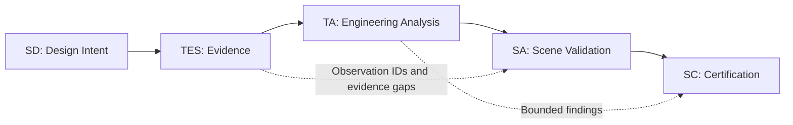

# VA-0001 - CAS Validation Architecture v1.0

## Record Control

- **Artifact ID:** VA-0001
- **Title:** CAS Validation Architecture
- **Version:** 1.0
- **Status:** Frozen
- **Scope:** Framework-level validation architecture

## Purpose

Define the engineering workflow used to validate creative design decisions within Concert Arc Studio (CAS). This architecture establishes the required relationship among design intent, evidence, analysis, scene validation, and certification.

## Core Principle

Everything flows from evidence.

Design intent defines the outcome to be tested. Evidence records what was observed. Analysis interprets that evidence. Scene validation evaluates the complete engineering unit. Certification issues a decision that does not exceed the available evidence.

## Engineering Workflow

| Phase | Artifact | Purpose |
|---|---|---|
| Design | SD | Define the intended engineering outcome. |
| Evidence | TES | Record reviewed observations without conclusions. |
| Analysis | TA | Interpret evidence and reach a bounded engineering finding. |
| Validation | SA | Evaluate scene-level behavior as a complete engineering unit. |
| Certification | SC | Decide whether the engineering objective has been achieved. |

`SD -> TES -> TA -> SA -> SC`

## Engineering Rules

### Rule 1: Design Intent Is Not Evidence

An SD defines the hypothesis or intended outcome. It must never be cited as proof that the outcome occurred.

### Rule 2: Evidence Precedes Conclusions

Observations must be recorded in a TES before engineering conclusions are written in a TA, SA, or SC.

### Rule 3: Conclusions Trace to Observation IDs

Every engineering conclusion must trace to one or more observation IDs. Traceability must remain specific enough for an independent reviewer to locate the supporting or contradicting evidence.

### Rule 4: Evidence Gaps Remain Visible

Unknowns, contradictions, and unresolved questions must be preserved until they are resolved by new evidence. They must not be removed merely because an artifact advances to the next workflow phase.

### Rule 5: Certification Is Limited to Available Evidence

A certification decision must not claim more than the supporting evidence establishes. A transition audit evaluates a transition. A scene analysis evaluates a scene. Broader claims require broader evidence.

## Artifact Relationships

Each downstream artifact inherits the traceability obligations and unresolved evidence gaps of the artifacts before it. Advancement through the workflow changes the level of engineering judgment, not the underlying evidence record.

## Reference Artifacts

| Artifact | Role | Status | Reference |
|---|---|---|---|
| TES-0016 | Reference evidence implementation | Complete | [TES-0016 - Medusa (Stone) to The One](../../01_Validation_Cases/VC-005_Affluenza/06_Engineering_Records/Transition_Evidence_Sheets/TES-0016_Medusa_Stone_to_The_One.md) |
| TA-0016 | Reference analysis implementation | Complete | [TA-0016 - Medusa (Stone) to The One](../../01_Validation_Cases/VC-005_Affluenza/06_Engineering_Records/Transition_Audits/TA-0016_Medusa_Stone_to_The_One.md) |
| SA-0002 | Reference scene-validation implementation | Pending | Pending implementation |
| SC-0002 | Reference certification implementation | Pending | Pending implementation |

The maintained reference index is available in [Reference Artifacts](Reference_Artifacts.md).

## Engineering Philosophy

CAS validation separates intent, observation, interpretation, and decision so that each engineering claim can be inspected on its own terms. The process values traceability over intuition, visible uncertainty over false completeness, and bounded conclusions over broad claims.

Creative judgment remains essential, but it becomes engineering knowledge only when the judgment is documented, supported by evidence, and limited to the scope actually evaluated. A frozen architecture provides a stable baseline. Improvements are introduced deliberately through Framework Contributions rather than through silent methodology drift.

## Versioning

| Field | Value |
|---|---|
| Validation Architecture Version | 1.0 |
| Status | Frozen |
| Change Control | Framework Contributions (FC) |
| Reference Implementations | TES-0016 and TA-0016 |
